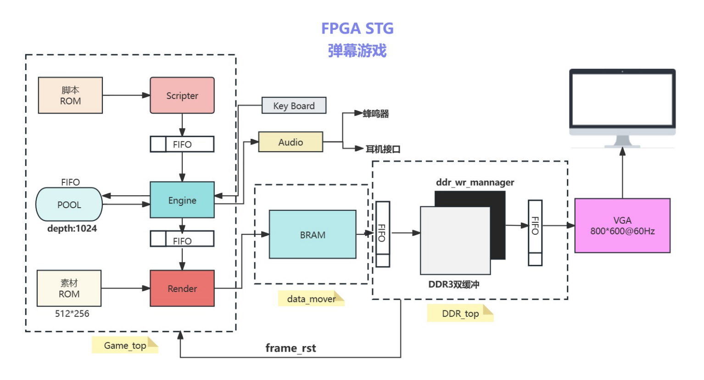

# FPGA STG - 基于 FPGA 的东方弹幕游戏

## 项目介绍

浙江大学 2023-2024 秋冬学期 《数字逻辑设计》大作业

我们使用 Vivado 和 [SWORD 4.0 开发板](http://www.sword.org.cn/hardwares/sword4.0) (XC7K160TFFG676-2L) 开发了一个可以运行在 FPGA 上的弹幕游戏引擎（或者说是符卡展示引擎，因为没写发射子弹和敌机的功能 orz）。

之所以说是“引擎”，是因为屏幕上的弹幕生成可以由格式简单的脚本控制，物体与素材的绑定也由描述文件控制，而无需直接接触 Verilog 代码。同时，显示在屏幕上的子弹数量是动态维护的，上限取决于 FIFO 的深度，而非例化固定数量的子弹模块并分别控制是否显示。

为了避免画面撕裂，并给游戏的渲染留足时间，我们选择了双缓冲的模式: 当 VGA 模块从 A 缓存读取画面时，游戏引擎向 B 缓存写入新的画面，当一帧绘制结束之后，进行缓存的切换，即 VGA 模块从 B 缓存读取，游戏引擎向 A 缓存写入，以此类推。受限于 SOWRD 板 `11,700 Kb` 的板载 BRAM 空间，我们无法在其上存储 2 帧 800x600 分辨率，每个像素 12bit 的画面。为此，我们转而使用空间更为充足板载的 DDR3 内存，并使用 MIG ip 核 (Native 接口) 将 DDR3 内存的读写封装成了一个巨大的 FIFO，以方便使用。

我们参考了 B站 UP 主 [@锑块](https://space.bilibili.com/8575641) 创作的视频 [波与粒的境界为什么长这样？这个视频会告诉你一切](https://b23.tv/av98646627)，在 FPGA 上复刻了东方 Project 中的经典符卡 —— 回忆「波与粒的境界」。

## 仓库文件结构介绍

- `danmaku` 文件夹为 Vivado 项目工程文件目录
- `module_demo` 文件夹下为键盘、音频、VGA 等模块的代码或 Demo 项目工程，以及一些适用于 Vivado 的引脚约束文件
- `resources` 文件夹为本项目中用到的静态资源文件
- `top.bit` 是可以烧写到 SWORD 板上的比特流文件，可以用于体验本项目实现效果
- `document.pdf` 为本项目构思以及实现方式的说明文档

省流:

1. 如果只是想看看我们做成了什么样子，可以到 bilibili 看看这个视频

2. 如果希望找到 SWORD 开发板的键盘、音频、VGA 模块 Demo 代码，或 Vivado 版本的引脚约束文件，请参考 `module_demo` 文件夹

3. 如果想研究这个项目的具体实现方式，请参见 [项目文档](document.pdf)

无论如何，请务必遵守 [诚信守则](https://www.zhihu.com/question/68235594/answer/261395370)。

## 参考项目与致谢

在完成课程设计的过程中，我们参考了很多作品，他们是：

- ZUN,《东方地灵殿》《东方风神录》
- [RogerDTZ/EGO1-Piano](https://github.com/RogerDTZ/EGO1-Piano)
- [Gralerfics/FmcPGA](https://github.com/Gralerfics/FmcPGA)
- [CY0807/BRAM_DDR3_HDMI](https://github.com/CY0807/BRAM_DDR3_HDMI)

在此对他们的作者表示感谢!